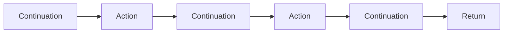

# Language

## Benefits Over Rust

- Higher kinded types.
- Effects.
- Cleaner syntax.
- Marker polymorphism.
- Generalized tuples.
- Parameterized modules.
- GADTs.
- Macro hygiene.

## Layout

Blocks start with the keywords `do`, `then`, `where`, and `match`. If block start keyword is at the start of a line, it can be indented by the same amount as the block header statement without creating a new line. Lines in a block can be separated explicitly with `,`. Blocks can be explicitly terminated with `;`.

```bandit
block header
do
    a statement
    another statement

    nested block header then
        a statement
        do a statement, another statement
        etc
```

If anything appears on the same line after the block keyword, it is a single line block:

```bandit
start of block do start of another block do statement
```

Omit the block start keyword for empty statements. We don't use `pass`, like python, as we use keywords to indicate the start of a block, instead of `:`, so it's visually obvious when a block is empty.

```bandit
trait EmptyTrait

type Void
```

## Types

### Coercion

The type `from` can can be coerced into `to` if there's an implementation for `Coerce from to`.

### Comments

Single line comments start with a `#`. This allows us to ignore the shebang in unix scripts.

Multiline comments are not supported because:

- comments are unstructured text that may contain any "end of comment" marker. For example, a code snippet may contain a string with the "end of comment" marker. This isn't such a problem with layout languages as each line in a block is prefixed by the same indentation.
- if a comment starts a new layout block, it really needs to start the line. That means it can't be used to comment part of an expression.
- single line comments give a clear separation between code and comments, even without syntax highlighting.

#### Doc Comments

A doc comment block is a block of contiguous lines starting with `##`. They must be contiguous and indented at the same level as the item they're documenting. Doc comments can only appear in certain places (before a module or item definition), and it's an error to put them elsewhere.

Doc comments are formatted using [a markup language similar to markdown](./Markup.md)

#### Doctests

There's no such thing as a doctest, just a unit test. The body of a function can be included in a comment. If you want a function definition included, make the function local to the function body.

## `match`

`match` defines a function that takes the pattern expressions as arguments. You can match a variable to paterns with `x . match ...`

## Syntax

The syntax is generally Haskell-like, but strict. To make a type into a reference, just add a lifetime. Lifetimes cannot be elided.

## Functions

```bandit
my_function1 x = stuff

my_function2 : a -> b match
    x then stuff

my_function3 : a -> b =
    \x do stuff

my_function4 x = \y: stuff

my_function5 : forall a b. a -> b match
    x then stuff

my_function6 : forall (a : Type) (b : Type). a -> b match
    some_pattern if condition then stuff
    another_pattern then other_stuff
    else more_stuff

my_function7 : a 'b -> a 'b -> a 'b with (Ord + Eq) a match
    x y then
        if x > y then x
        else y

my_function8 : Option a -> Option a -> Option a match
    (Some x) _ then x
    _ (Some y) then y
    _ _ then None

my_function9 : Option a -> Option a -> Option a match
    (Some x) _ then x
    _ (Some y) then y
    _ _ then None

simple_quantification : forall ('a : Lifetime) (Ord t). t 'a -> t 'a

multiplicity : Int 'a 1 -> Int 'a 1

multiplicity_polymorphism :  Int 'a n ->  Int 'a n
```

`f do ...` (with no arguments) is short for `f () do`. Similarly for `match`, but not for `=`, as that's for constants. Use `f = do ...` if you want a function that's a block that returns a function.

## Contexts

The context of a type variable can be defined in the `foreach` or `with` clause. The context of a function can only be specified in the `with` clause. `( Y + Z) X` means traits `Y` and `Z` are implemented for `X`. Functions might want to specify marker traits like `Send`.

Rust:

```rust
fn f<A>(x: impl X)
where
    A: X + Y + 'static,
    A::B: X + Z<Int>,
{...}
```

Bandit:

```bandit
f (x : X) : () with
    (X + Y + 'static) a
    (X + Z Int) (B a)
do
    ...
```

## Lambdas

Lambdas are defined exactly like names functions, but their name is `\`. So:

```bandit
\x y = z x y
\x y do
    z xy
\x y match
    ...

\ : Int -> Int -> Int = add
```

## Type Application

Like [Ghc's TypeApplications](https://ghc.gitlab.haskell.org/ghc/doc/users_guide/exts/type_applications.html). Unlike Ghc, if an explicit `forall` is not specified, the order of variables is strictly the order they appear in the type. Type application is not supported on inferred types. Use `infer` for a type hole.

```bandit
f : a -> a -> a

g = f @ Int
```

We don't allow types (or normal parameters) to be specified via named parameters because:

- handling the remaining parameters become more complex.
- the name of parameters becomes part of the public interface.

## Rank N Types

```bandit
rank2 : (forall a. a -> b) -> c -> d
```

We need to [defunctionalize](https://en.wikipedia.org/wiki/Defunctionalization) this to lower it to Rust.

## Constants

```bandit
my_constant1 = 42
my_constant1 : Int = 42
```

## Literals

Multiline string literals begin with 3 or more `"`s and a newline. The initial newline doesn't appear in the string. They end with the same number of `"`s. Indentation is not removed, but this could be done with a function if required. For example:

```bandit
"""
line1
line2
"""

""""
line 1
line 2
""""
```

## Closures

```bandit
\x y z = stuff
\(x : Int) (y : Int) : Int = stuff
\x y z do
    stuff
    more_stuff
```

There are no zero argument functions. `\do` is short for `\() do`.

Some control flow examples:

```bandit
xs.for \x do
    stuff
    more_stuff

xs.for \x = stuff
```

## Data Types

### Tuples

There are only 2 types of tuple, `()`, and `Pair x y`. `(x, y, z)` is syntactic sugar for the nested pairs `(x, (y, (z, ())))`. This allows traits to be written to consume the tuple. For example, the Haskell:

```haskell
class Apply f t r where
  apply :: f -> t -> r

instance Apply a () a where
  apply x () = x
  
instance Apply f_tail tuple_tail result => Apply (arg -> f_tail) (arg, tuple_tail) result where
  apply f (x, y) = apply (f x) y

f :: Int -> Int -> Int
f = (+)

x :: Int
x = apply f (1 :: Int, (2 :: Int, ()))
```

can be written as:

```bandit
trait Apply a r where
    apply : self -> a -> r

Apply (arg -> f_tail) (arg, tuple_tail) result
with Apply f_tail tuple_tail result
    apply self (fst, snd) = apply (f fst) snd

Apply (() -> result) () result where
  apply self () = self ()

f : Int -> Int -> Int = (+)

g : Int = f.apply (1 : Int, 2 : Int)
```

### Sums

```bandit
type MySum where
    MyEmptyVariant
    MySumOfProduct record field1 field2 : U32
    MyVariant U32 U64

type MyGenericSum a b where
    Single a
    Pair record first : a, second : b

type Term a where
    Empty with a = ()
    Literal a
    Equal b b with Compare b, a = Bool
    Pair record first : f, second : s with a = (f, s)
    ExplicitlyQuantifiedPair forall f s. record
        first : f
        second : s
    with
        a = (f, s)
```

Type constructors are namespaced under their type. For example, `MySum::EmptyVariant`.

`record` allows you to name the fields. Multiple fields with the same type can be defined on a single line.

GADTs are not very easy to map to Rust. For example, the `Equal` variant needs to be expanded to include a variant for each type sent to `Equal` (or alternatively, erase the type via a boxed `dyn` trait).

With GADTs, we can use the more specific result type in a pattern match:

```bandit
eval : Term a -> a match
    Empty then ()
    Literal i then i
    Equal i j then i == j
    Pair x then (x.first, x.second)
    ExplicitlyQuantifiedPair first, second then (f, s)
```

This is where things diverge from Haskell. Record syntax is not just sugar. So `x` in `Pair x` above is the entire record, which can be accessed with `.` notation.

### Products

Products are just sums with only 1 variant. It's suggested to use the name `New`, unless some other name makes sense.

For example:

```bandit
type MyUnit where New
type MyType where New U32
type MyProduct where New record field1 field2 : U32
type MyGenericProduct a where
    New record
        field1 : U32
        field2 : a
```

### Higher Kinded Types

```bandit
type Wrapper (container : Type -> Type) (element : Type) where New (container element)

hkt : forall (container : Type -> Type) (element : Type).
    container element -> ()
    with MyTrait container
```

## Dot Notation

There's no special dot notation. `.` is just an operator. Operators lookup their 2nd argument additionally in the module of the 1st arguments type.

`.` has higher precedence than function application, so `.` `x.f y` is equivalent to `f x y`.

`.` is left associative, so `a.b.c` is equivalent to `(a.b).c`.

TODO: What to use for function composition?

## Relevant Types

Types have a `Drop` marker to describe allowed behaviour around dropping:

- `Anywhere`: Values can be freely dropped.
- `OnError`: Values can be discarded when effects terminate, but not when they go out of scope.
- `Never`: Values cannot be dropped. They must be destructured or moved before they go out of scope.

## Traits

Traits use the Rust coherency rules.

### Disambiguating Trait Members

Like Haskell.

TODO: Do we want the Haskell style ambiguity check?

```bandit
trait MyTrait where
    alias MyType

    f : Int
```

Both `MyType` and `f` are ambiguous and so can never be called.

```bandit
trait A a where
    alias R a
    f : R a

trait B a where
    f : forall a. Int

type X

A X where
    alias R X = Int
    f = 1

B X where
    f = 2

g : Int = f @ X

data Y a = New a

A (Y a) where
    alias R (Y a) = Int
    f = 1

B (Y a) where
    f = 1

data Z = New Int

A Z where
    alias R Z = Int
    f = 1

h : Y t -> R (Y t) match
    _ then f @ (Y t)

j : Z -> Z::R match
    _ then f @ Z
```

`h` is equivalent to the Rust code:

```rust
fn h<T>(_: Y<T>) -> A::R {
    <Y<T> as A>::f()
}
```

### `Fn` Traits

The act of calling a function either consumes it (for owned `FnOnce` values), uniquely uses the reference (for `FnMulti` values) or uses the shared reference (for `Fn` values). Type signatures are desugared depending on whether their args are references, unique references, or owned. Currying gives back something based on it's current `Fn` + whether it's newly bound argument is a shared ref (`Fn`), unique ref (`FnMut`) or owned (`FnOnce`).

```bandit
f : a -> b -> c
f1 : Fn(a -> FnOnce(b -> c))

g : a 'x -> b -> c
g1 : Fn(a 'x -> Fn(b -> c))

h : a 'x 1 -> b -> c
h1 : Fn(a 'x 1 -> FnMut(b -> c))
```

Functions by default are desugared to `Fn`:

```bandit
use_fn_multi : (a -> b) -> a -> b
use_fn_multi1 : Fn (a -> b) -> a -> b

use_fn_mut : FnMut (a -> b) -> a -> b
use_fn_once : FnOnce (a -> b) -> a -> b
```

The default trait to return is `Fn`.

```bandit
make_fn_multi : a -> b
make_fn_mut : FnMut (a -> b)
make_fn_once : FnOnce (a -> b)
```

#### Implementing `Fn` Traits

```bandit
Fn MyType where
    call x = do_stuff
```

### Named Implementations

Named implementations are a bad idea because:

- They break global coherence. For example, an `insert` function on `OrderSet Int` could be called with a `Reverse` `Ord` instance and put the new element in the wrong place.
- There are issues around subtyping. What happens if we add another trait to the context of `Monoid`? Would a `Sum` implementation need to implement it? It may be incorrect to use the global `impl`.

## Modules

```bandit
module my_module
```

### Exporting Names

`public` can be put in front of any trait, type, or top level function with type signature to export the name. `public *` can be put in front of any

- type: meaning export all data constructors
- trait: meaning you can use the methods, or provide extra implementations for the trait
- alias: aliases are always transparent

### Importing Names

```bandit
use
    std (X, RenamedY = Y)
    my_module
    my_module (A, f)
        deeply_nested = my_nested_module::my_deeply_nested_module
```

This will import `std.Y` as`RenamedY`. These are all the imported names:

- `X`
- `RenamedY`
- `my_module`
- `A`
- `f`
- `deeply_nested`

### Parameteric Modules

```bandit
use
    other_module.MyTrait

module my_module : forall a b. (Eq a, MyTrait b)
...
```

`my_module` takes 2 types, `a` and `b` where `(Eq a, MyTrait b)`. Types `a` and `b` can be used in module items. All module items are distinct from other instances of this module with a different type.

Parameteric modules can be imported with:

```bandit
use
    my_module
        my_sub_module Int Int (A, f)
        my_byte_module = my_sub_module Byte Byte
        my_byte_module (A, f)
```

## Control Flow

Some control flow is implementated natively:

- because the borrow checker needs to understand it.
- otherwise the pattern matching would be unweildy.

In particular, with `if`/`else` and `match`, the borrow checker needs to understand that only one branch will be run, so it's OK to move the same thing inside each branch.

```bandit
x . match
    Some x if x > 10 then ...
    Some 10 then ...
    _: ...

if x < 10 then
    something

if x < 10 then
    something
else if x < 20 then
    something_else
else
    something_else_again

while let Some x = y do
    stuff
    more_stuff
```

## Effects

TODO: We should require the effect data when calling an effect. If there's no data, we can just construct empty data when needed. This allows us to disambiguate between multiple effects if needed.

TODO: I think all we need is effect support in the type system, and a `continuation` function.

Effectful blocks are compiled to [delimited continuations]. Each continuation is delimited by an action that takes some parameters and yields a value.

- The continuation state could allocate an untagged union in which to store the action arguments and results. Actions could read and write them.
- The stack can be used for "tail resumptive" actions, but that would mean they wouldn't yield. This could be confusing where an action expects clients to be able to observe some state between continuations. Iteration, for example. Therefore it would need to be explicit.

The order of effects only matters when you're peeling them off the stack: See this Stack Overflow answer about [Monad Transformers]. In particular, the return value will change if 2 or more handlers wrap it. `WrappedByHandler2 (WrappedByHandler1 x)` if handler 1 is run first, vs `WrappedByHandler1 (WrappedByHandler2 x)` if handler 2 is run first.



Client code is divided into continuations that take the result of an action and return the next action, like the diagram above.

Applying a handler to the continuation code will call the handlers actions inline with the client code after each continuation.

An action has serveral options:

- Call the continuation directly on the same call stack.
- Drop the continuation, which will cleanup all the objects on the continuation stack.
- Queue the continuation somewhere.
- Clone the continuation and do any of the above with each copy.

[LLVM Coroutines] may not be suitable, as Rust/Zig don't use them. [WebAssembly Effect Handlers] are another possibility.

TODO: How to label functions as copyable in a delimited continuation context?

An effect is a trait with methods of the form:

```bandit
method
    : Effect 'a mut
    -> Continuation ActionReturnType output
    -> ActionArg1
    ...
    -> ActionArgN
    -> Output Effect
```

and a parent trait:

```bandit
trait Effect eff output where
    alias Output eff;

    result : output -> Output eff
```

Handling an effect produces a `Continuation` that can be sequentially run or interleaved with other tasks via a user defined scheduler.

```bandit
type Continuation input output

Continuation cont input output where
    # Run to completion
    resume : cont -> input -> output
    run_one : cont -> input -> Option output

type Task state output

Task state output where
    run_one : Self -> state 'a mut -> output
```

`handle` is a built in function that divides a function into delimited continuations and links effect action calls to effect trait methods. `::` is a cons for sets.

```bandit
handle : (() -> {e :: es} ()) -> e -> {es} ()
```

### Examples

#### Exceptions

Define the exception effect:

```bandit
trait ExceptionEffect eff output with Effect eff output where
    alias Error eff

    throw
        : eff 'a mut
        -> Continuation String output
        -> Error eff
        -> Output eff

type Exception error where New (PhantomData error)

Effect (eff = Exception error) output where
    alias Output eff = Result output error

    result = Ok

ExceptionEffect (eff = Exception error) output where
    alias Error = error

    throw _self _contination = Err

try (f : () -> {Exception error :: effects} result) : {effects} result do
    (handle f).run Exception::New.mut
```

Define an error type and try/catch an exception:

```bandit
type MyError where New String

f : () -> Result Int MyError = \do
    try \do
        print "About to throw"
        throw? (MyError "Testing")
        print "Unreachable!"
        42
```

#### IO

An IO action will kick off the IO then pass a future back to the continuation. The future is passed to an action handler called await to handle it. The action handler must match up the future to the IO result and then pass the future output back to the continuation. This means `await?` would just be an effect action.

TODO: Write the example

#### Async

To spawn a task, an additional continuation is passed to the action.

TODO: Write the example

#### Iterator

```bandit
trait IteratorEffect eff output with Effect eff output where
    alias Item eff

    yield
        : eff 'a mut
        -> Continuation () output
        -> Item eff
        -> Result eff

type IteratorData item where New (Option item)

Effect (eff = IteratorData item) () where
    alias Result eff = ()

    result  = id

IteratorEffect (eff = IteratorData item) where
    alias Item eff = item

    yield self cont i do
        self.0 = Some i
        cont.resume ()

type Generator item where
    New (Task (IteratorData item) ())

Generator item where
    new
        (f : () -> {IteratorEffect :: effects} ())
        : {effects} Self
        = (handle f).run (IteratorData::New @ item None).mut

Iterator (iter = Generator item) where
    alias Item iter = item

    next self do
        let mut data = IteratorData None
        self.0.run_one data.mut
        data.0
```

## Kinds

Kinds are the type of types.

```bandit
Int : Type
alias Type = Kind 0
Type : Kind 1
Kind n : Kind (n + 1)
```

## Lifetime Subtyping Constraints

```rust
fn f<'a, 'b: 'a, T>(x: &'a T, y: &'b T)
```

is equivalent to:

```bandit
f : t 'a -> t 'b -> () with ('a <= 'b)
```

## TODO

## Brand Types

Each time a `GhostToken` is created, we need to make sure it's brand type can't be unified with another. It would be great to allow this type to be scoped to a non-copyable value.

## Constraint Kinds

This allows constraint aliases, among other things. See GHC's [ConstraintKinds](https://ghc.gitlab.haskell.org/ghc/doc/users_guide/exts/constraint_kind.html) language pragma. We could just do constraint aliases as `type NewConstraint[A] = (Constraint(A), Constraint(B))`. Need to think about constraint syntax. Using `T: Constraint => Type`, `T: Constraint` and `T: Type` are ambiguous. How about `T => Constraint: Type`

## Misc

Effects (algebraic or mondaic)? i.e. Do we allow multiple resumes from the effect handler? See [Structured Asynchrony with Algebraic Effects](https://www.microsoft.com/en-us/research/wp-content/uploads/2017/05/asynceffects-msr-tr-2017-21.pdf)

Macros
Reflection
Tail calls?
Identity functor
GC as an effect? Regional GC?
Allocation as an effect?

## Type Synonyms

`alias MyType[a, b, c] = ...`

## Macros

### Zig

[Array of struct to struct of arrays](https://github.com/ziglang/zig/commit/0808d98e10c5fea27cebf912c6296b760c2b837b)

### Hygiene

All macro code is generated in a module that is inaccessible to anything else. All public symbols are exported into the parent.

### Deriving

```bandit
pub type Term[a] = pub
    Lit(Int) where a = Int
    Pair(Term x, Term y) where a = (x, y)
    deriving (Eq, MyTraits)
```

A derive macro for `Eq` can only produce an instance for `Eq`. A trait alias can be specified, and the deriving macro must derive all the traits listed on the RHS of the alias before the `where` clause.

## Pin

A `Move` trait would have been easier to implement in Rust, but wouldn't have been backwards compatible. See [Changing the Rules of Rust](https://without.boats/blog/changing-the-rules-of-rust/).

## DataKinds

Simple values could be turned into types. Like `type(MyEnum.Variant1)`, or `type(1)`. They could implement a `Const[ValueType]` trait with a `value()` method which gives simple const generics.

## Marker Polymorphism

We want a mechanism to carry a marker trait from a generic parameter to a result. For example, we may want to take a future, and return one with the same `Send`ness. Same for `Sync` and `ScopeDrop`. Would we ever want to do this for non-marker traits?

```bandit
run[F](f: F) -> impl Future<Output = ()> + F(Send + Sync + ScopeDrop)
where
    F: Future<Output = ()>
```

Or maybe we need `AsyncSend` and plain `Async` effects (or some kind of polymorphic `Async`)? Maybe `Future` could have an extra type parameter for the thread safety, with appropriate `impl`s for `Send`?

We could implement compile time markers as a single trait with associated types. e.g:

```bandit
trait Marker {
    const Send: bool = true;
    const Move ...
}

run[F](f: F) -> impl Future<Output = ()> + Marker<Move = F::Move> 
where
    F: Future<Output = ()>
{
    ...
}
```

Then everything would implement `Marker`.

## Signals

```bandit
impl[First, Second, SigFirst, SigSecond] Signal[Item = (First, Second)] for (SigFirst, SigSecond)
where
    SigFirst: Signal<Item = First>,
    SigSecond: Signal<Item = Second>
{
    ...
}

type Pair[First, Second](first: First, second: Second);

impl[First, Second] Pair[First, Second] {
    new_signal(
        first: impl Signal[Item = First], 
        second: impl Signal[Item = Second]
    ) -> impl Signal[Item = Self] {
        ...
    }
}
```

## GhostCell

Does compile time support for `GhostCell` add anything, as it requires being inside a closure currently. Is there a generalization for tracking the lifetime of things here?

## References

Is there anything we can do about having to convert to/from refs all the time? Maybe a mutability checker + GC + GC Effect, then we can gradually degenerate to something like Rust? Check out [Mutable Value Semantics](https://www.jot.fm/issues/issue_2022_02/article2.pdf)

## Garbage Collection

Provide hooks for GC? Need to know if a thing is on the stack (directly or indirectly), or the heap. Also need to know when it moves. Is it possible to know if it's on the stack? A function could be called on a mutable ref, and it's unknown if that ref is on the stack. We'd also need to be able to collect all the `Gc` things that live inside an object. That would infect the language quite substantially. A vector, for example, would need to implement `Collectible`. Maybe it's not too bad.

### Borrowing

Effects interact with borrowing, as the borrow checker needs to know if an effect terminates execution or may continue.

### Exceptions

Rather than returning a union of errors, multiple exception effects could be combined and handled individually. Of course, an expection with a normal union type can still be used.

## Type Inference

[Problems with type inference is a problem introduced with polymorphism](https://news.ycombinator.com/item?id=20717635). You can't infer the type of `read` for example.

## Single Method Traits

Traits with single methods can just inherit `Fn` traits:

```rust
trait MyTrait: FnOnce() -> U32 {}
```

## Const Generics

TODO: Should we just use `type(1)` with a constraint of `Value[T]` etc?
TODO: Which value types should be allowed? We need to be able to equality match for instance selection. Should we do a structural equality match, or use the `Eq` instance?

The type of compile time arguments are assumed `Type`. Value types are allowed.

```bandit
f[T, U, V, Value: U32]() {

}

f[T, U, V, 1]();
```

## Scoped Types

It might be useful to have a type that only exists while a variable is in scope. This could be used for ghost cell.

## Build System

- Module: a collection of source files
- Compilation unit: a collection of modules, and a lightweight build file to specify dependencies
- Package: A collection of compilation units + a main compilation unit
- Executable: Build configuration (platform, features etc) is specified using types/traits.

## Links

- [Syntax and Semantics of Quantitative Type Theory](https://bentnib.org/quantitative-type-theory.pdf)
- [Interesting article about `PhantomData` and subtyping](http://troubles.md/why-phantomdata/)
- [Less Painful Linear Types](http://aidancully.blogspot.com/2021/12/less-painful-linear-types.html)
- [Idris Named Instances](https://idris2.readthedocs.io/en/latest/tutorial/interfaces.html#named-implementations).
- [Exotic Programming Ideas: Part 1 (Module Systems)](https://www.stephendiehl.com/posts/exotic01.html)
- [Understanding and Evolving the ML Module System](https://people.mpi-sws.org/~dreyer/thesis/main.pdf)
- [Asyncify](https://kripken.github.io/talks/2022/asyncify.html#/)

### Interesting Languages

- [Frank](https://arxiv.org/pdf/1611.09259.pdf)
- [Koka](https://koka-lang.github.io/)

### Libraries

- [eff (Haskell)](https://hasura.github.io/eff/Control-Effect.html)

### Haskell Extensions

- [BlockArguments]
- [Kind Signatures](https://ghc.gitlab.haskell.org/ghc/doc/users_guide/exts/kind_signatures.html)
- [Explicit Universal Quantification](https://ghc.gitlab.haskell.org/ghc/doc/users_guide/exts/explicit_forall.html)
- [ConstraintKinds](https://ghc.gitlab.haskell.org/ghc/doc/users_guide/exts/constraint_kind.html)
- [Existentially Quantified Data Constructors](https://ghc.gitlab.haskell.org/ghc/doc/users_guide/exts/existential_quantification.html)

[BlockArguments]: https://ghc.gitlab.haskell.org/ghc/doc/users_guide/exts/block_arguments.html?highlight=blockarguments
[Monad Transformers]: https://stackoverflow.com/a/5076096
[delimited continuations]: https://www.youtube.com/watch?v=TE48LsgVlIU
[WebAssembly Effect Handlers]: https://wasmfx.dev/
[LLVM Coroutines]: https://llvm.org/docs/Coroutines.html
